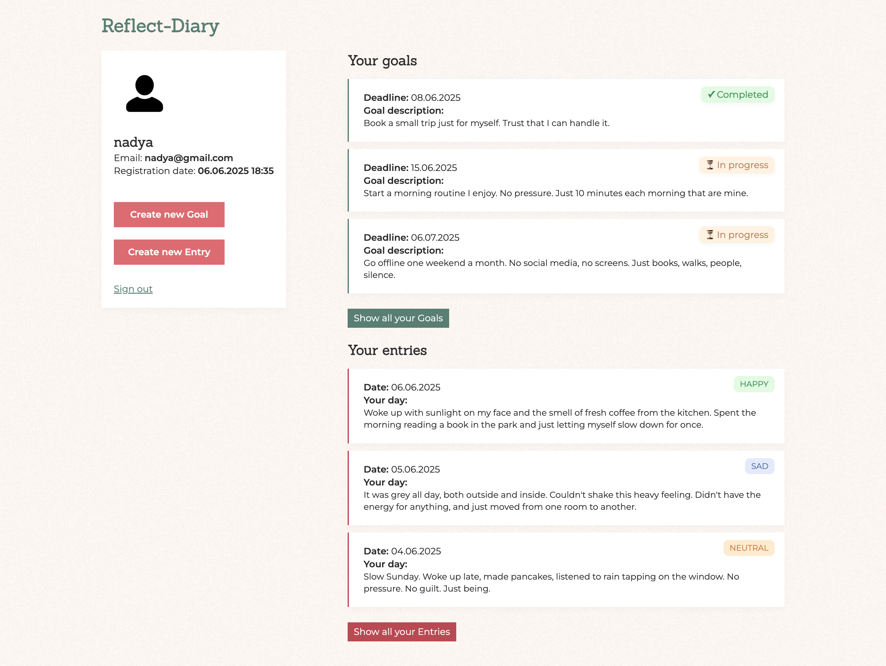
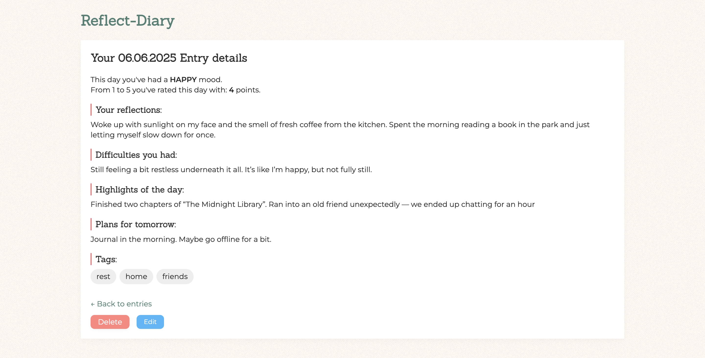

# Reflect Diary

**Author**: Nadezhda Grishina  
**Last Update**: June 5, 2025

---

## 💻 About the Project
**Reflect Diary** is a personal reflection journal web app where users can write about their day, track goals, rate their mood, and answer reflective questions. It combines structure and freedom — helping users build healthy reflection habits.

---

## 🪩Features

- 📝 User registration & login (Spring Security)
- 📅 Create / edit / delete daily entries
- 🎯 Create and manage personal goals
- 😊 Mood and score tracking for each day
- ❓ Random reflection question in each entry
- ✅ Mark goals as completed

---

## 🛠 Technologies Used

- **Backend**: Java 21, Spring Boot, Spring Security
- **Frontend**: Thymeleaf templates
- **Database**: MySQL
- **Build Tool**: Maven

---

## 🚀 Running the Project

1. Clone the repository:
    ```bash
   git clone https://github.com/nadyagrishina/reflect-diary.git
   ```
2. Open in IntelliJ or another IDE
3. Configure the database in `application.properties`:
   ```properties
   spring.datasource.url=jdbc:mysql://localhost:3306/reflect_diary
   spring.datasource.username=your_username
   spring.datasource.password=your_password
   spring.jpa.hibernate.ddl-auto=update
   ```
4. Run the project ( via `ReflectDiaryApplication` class)
5. Open browser at:  
   `http://localhost:8080`
6. Use `/register` to create an account, then `/login` to access your diary.

## 🖼️ Screenshots

### 🌿 Dashboard (Goals & Entries overview)

The main dashboard displays user profile info, current goals, and the latest journal entries:



---

### 📖 Entry Details

Each entry includes your mood, reflections, difficulties, highlights, and tomorrow's plan — with optional tags:



🤝 Contributions
Pull requests are welcome.
Feel free to fork the repo and suggest improvements or enhancements.

